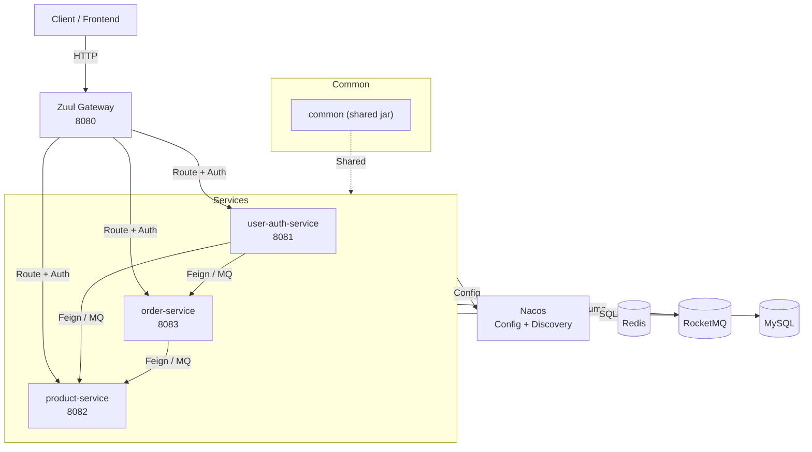
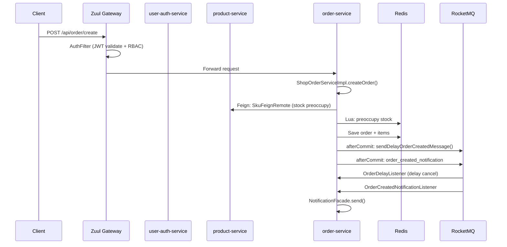

# ARCHITECTURE.md

High-level architecture of `shop_demo`, generated from the GitNexus knowledge graph.

## Overview

`shop_demo` is a Maven multi-module Spring Cloud e-commerce project using Spring Boot 2.3.x, Spring Cloud Hoxton, Spring Cloud Alibaba 2.2.x, and Nacos 1.4.1. It consists of a Zuul API gateway, three business services (user-auth, product, order), and a shared `common` module.

- **183 files**, **1443 symbols**, **104 execution flows** indexed.
- Services communicate via OpenFeign (synchronous) and RocketMQ (asynchronous).
- Redis is used for caching, stock counters, distributed locks, and RBAC permission caching.
- Nacos provides configuration management and service discovery.

## Functional Areas

| Area | Symbols | Cohesion | Description |
|------|---------|----------|-------------|
| Controller | 63 | 72% | REST API endpoints across all services |
| Service | 35 | 94% | Business logic layer (ServiceImpl) |
| Util | 25 | 79% | Utility classes (JwtUtils, RedisCacheUtils, MqMessageUtils, etc.) |
| Strategy | 19 | 80% | Stock deduction strategies (ImmediateDeductStrategy, PreoccupyDeductStrategy) |
| Handler | 19 | 97% | Chain-of-Responsibility handlers for MQ listeners |
| Vo | 17 | 88% | Response DTOs |
| Advice | 13 | 88% | Global exception handlers |
| Oss | 12 | 77% | Aliyun OSS file upload service |
| Impl | 11 | 80% | Service implementations |
| Filter | 10 | 62% | Servlet filters (TokenFilter, TraceFilter) and Zuul filters |
| Notify | 8 | 100% | Notification adapters (DingTalk, Email, SMS) and facade |
| Template | 6 | 100% | Cache-aside template (CacheTemplate, ProductCacheTemplate, SkuCacheTemplate) |

## System Architecture



## Key Execution Flows

### 1. Logout → ParseToken (Auth Flow)

Cross-community flow. JWT token parsing on logout.

```
1. logout   UserController      (user-auth)
2. logout   UserServiceImpl     (user-auth)
3. getUserId JwtUtils            (common)
4. parseToken JwtUtils           (common)
```

### 2. Pay → Success (Order Payment Flow)

Cross-community flow. Order payment triggers stock confirmation and status update.

```
1. pay      ShopOrderController   (order)
2. payOrder ShopOrderServiceImpl  (order)
3. getById  SkuController         (product)
4. success  ShopResult            (common)
```

**Post-commit**: `afterPayCommit()` sends orderly MQ messages for DB stock persistence (preoccupy strategy).

### 3. Cancel → Success (Order Cancellation Flow)

Cross-community flow. Cancels order and releases stock.

```
1. cancel   ShopOrderController   (order)
2. cancelOrder ShopOrderServiceImpl (order)
3. getById  SkuController         (product)
4. success  ShopResult            (common)
```

### 4. Detail → Success (Order Detail Query)

Cross-community flow. Queries order detail with items, potentially hitting product service.

```
1. detail   ShopOrderController   (order)
2. detail   ShopOrderServiceImpl  (order)
3. getById  SkuController         (product)
4. success  ShopResult            (common)
```

### 5. DeltaStock → DelayDoubleDelete (Stock Update Flow)

Intra-community flow. SKU stock mutation with cache consistency.

```
1. deltaStock SkuController       (product)
2. deltaStock SkuServiceImpl      (product)
3. delayDoubleDelete RedisCacheUtils (common)
4. delayDoubleDelete RedisCacheUtils (common)
```

Uses atomic DB `setSql("stock = stock + {delta}")` and Redis Lua `decrby`/`incrby`, followed by delay-double-delete for cache consistency.

## Module Interactions



## Notable Patterns

- **Chain of Responsibility**: `OrderDelayListener` and `StockUpdateListener` use handler chains assembled via `@PostConstruct` with `setNext()`.
- **Strategy Pattern**: `StockStrategy` interface with `ImmediateDeductStrategy` and `PreoccupyDeductStrategy` implementations.
- **Adapter Pattern**: `NotificationSender` adapters (`DingTalk`, `Email`, `SMS`) with `NotificationFacade` as unified entry point.
- **Cache-Aside Template**: `CacheTemplate<T>` abstract class for read-through caching with `ProductCacheTemplate` and `SkuCacheTemplate` implementations.
- **Delay Double Delete**: `RedisCacheUtils.delayDoubleDelete()` guards against stale reads after DB mutations.
- **TransactionSynchronizationAdapter.afterCommit()**: Ensures MQ messages are only sent after DB transactions commit.